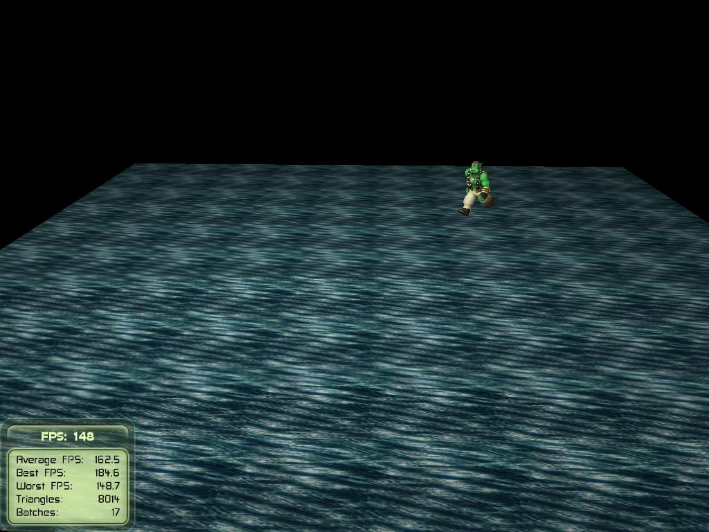

# Game Programming in OGRE

  

**Game programming in C++ with OGRE.**

Implementation of key game programming elements in C++ using OGRE. 
Examples include level loading, path finding using A*, 
flocking using Boids, projectile motion, and collision detection.

## Contents

### HW01: Getting Started

Simple getting started tutorial.

### HW02: Walking

Moving animated models around the game world. Features rigged and animated models.

### HW03: Level Loading

Loading level objects and layouts from simple text files. Includes several levels
with varying objects. Objects include models, particles, and characters.

### HW04: Path Finding

Moving agents throughout the grid world, avoiding any obstacles along their paths.
Features A* path finding to avoid objects in the world.

### HW05: Boids

Flocking using a simple BOIDs model. Simulates cohesion, separation, and alignment of
agents.

### HW06: Physics

Projectile motion with collision detection. Uses simple physics with axis aligned 
bounding box collision detection.

### HW07: Game

An original game prototype designed and implemented in OGRE. 

